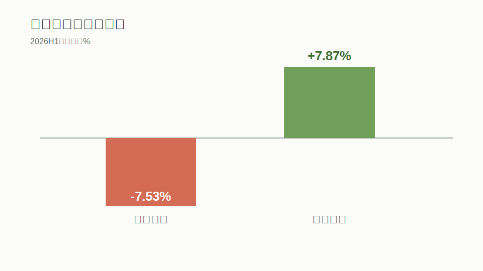
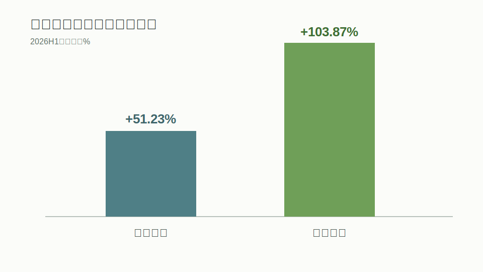
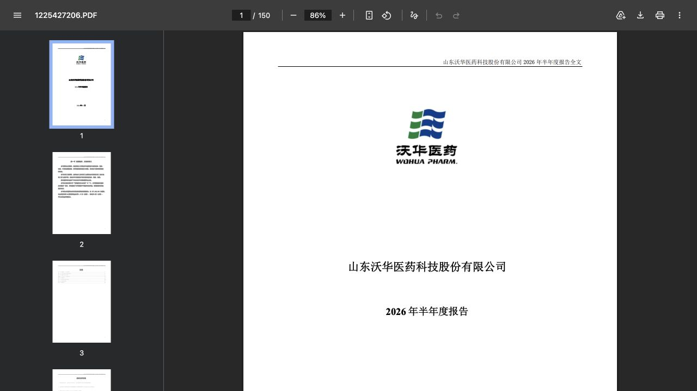
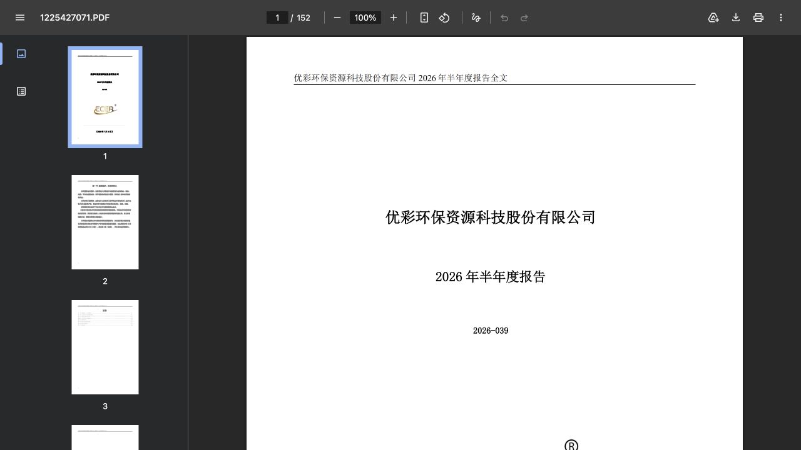
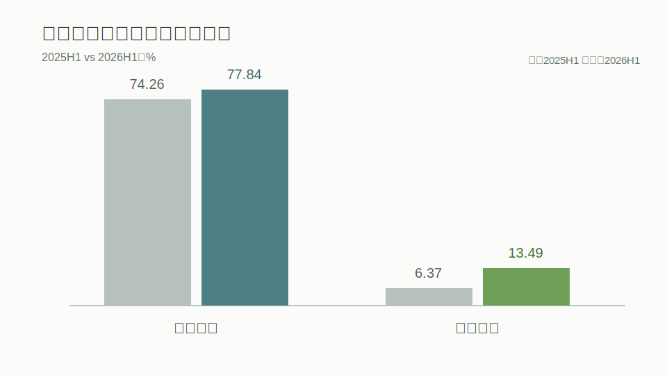
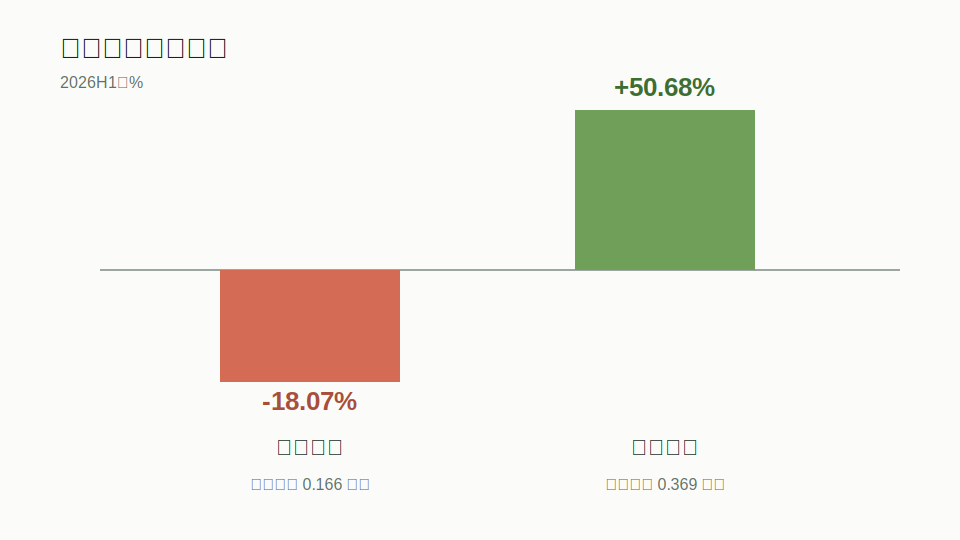
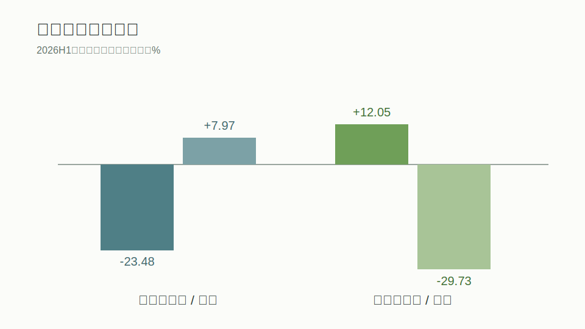
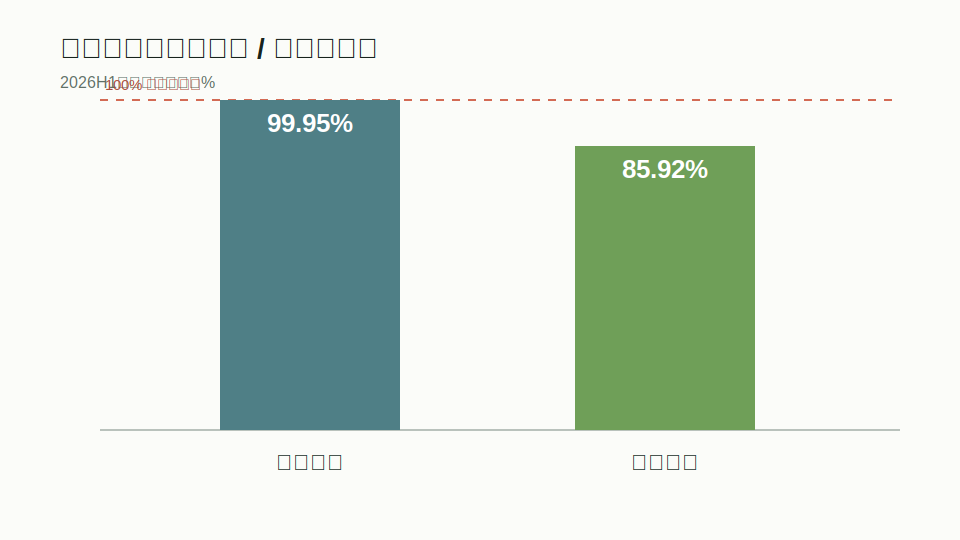
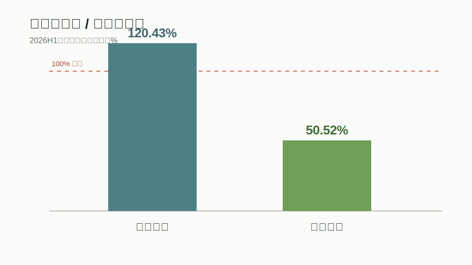
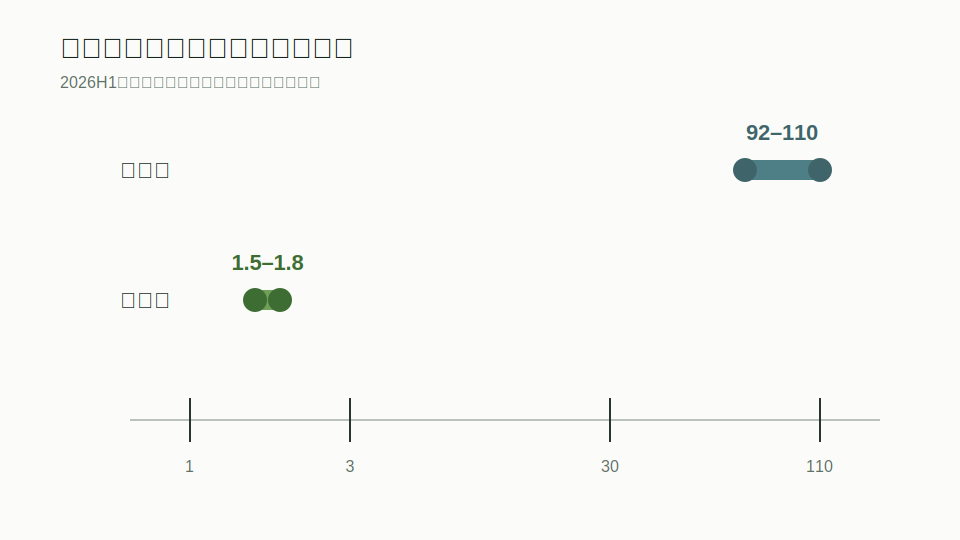

# 2026年7月16日财报：首批半年报验证利润质量，预告高增长进入“现金流审问”

**报告日期：**2026年7月16日  
**分析截至：**2026年7月17日  
**覆盖范围：**沃华医药（002107）、优彩资源（002998）正式半年报；江波龙（301308）、埃斯顿（002747）半年度业绩预告；7月16日财政新闻。  
**研究结论性质：**公开信息研究，不构成投资建议。

## 一、执行观点与业绩判定

7月16日是2026年A股中报季从“预告交易”走向“报表验证”的第一个关键节点。**事实：**沃华医药、优彩资源披露正式半年报；截至当日19时，21世纪经济报道统计已有1697家公司披露上半年业绩预告，AI算力、机器人、创新药成为高增长密集区。正式报表提供现金流、资产负债表和费用明细，因而比单纯预告更能检验增长含金量。

本文的核心结论有三层。第一，沃华医药是典型的“降收增利”：营收下降7.53%，但营业成本和销售费用分别下降20.39%、19.16%，毛利率升至77.84%，归母净利润增长51.23%。经营现金流超过归母净利润，说明本期利润并非只停留在权责发生制层面；不过研发费用下降18.07%、存货上升7.97%，收入恢复能力仍是最大问号。

第二，优彩资源是“收入温和增长、价差与效率显著修复”：营收增长7.87%，归母净利润增长103.87%，毛利率由6.37%升至13.49%。但经营现金流只有归母净利润的约50.52%，应收账款增长12.05%，财务费用增长829.69%，提示利润扩张还没有完全转成自由现金流。第三，江波龙、埃斯顿的预告证明高景气赛道正在兑现利润，但增长倍数受到上年低基数强烈放大，不能与正式报表的利润质量等量齐观。

**表1：7月16日重点公司业绩仪表盘**  
期间：2026H1；单位：亿元、%；口径：合并报表归母口径，预告公司为预计区间；来源：公司公告、CNINFO、AKShare结构化财务报表、21世纪经济报道；检索日：2026-07-17。

| 公司 | 披露类型 | 营业收入 | 收入同比 | 归母净利润 | 归母同比 | 一句话判定 |
|---|---:|---:|---:|---:|---:|---|
| 沃华医药 | 正式半年报 | 3.93 | -7.53% | 0.68 | +51.23% | 降本增效强，收入与研发承压 |
| 优彩资源 | 正式半年报 | 13.30 | +7.87% | 0.83 | +103.87% | 毛利率修复，现金转化待加强 |
| 江波龙 | 业绩预告 | 220–250 | +115.78%–145.20% | 92–110 | +62204.03%–74393.95% | 存储景气兑现，低基数放大 |
| 埃斯顿 | 业绩预告 | 未披露 | 未披露 | 1.50–1.80 | +2144.74%–2593.68% | 机器人放量，关注海外投入 |

图1注：期间2026H1；单位%；口径合并营业收入同比；来源沃华医药、优彩资源半年报及AKShare结构化报表；检索日2026-07-17。

图2注：期间2026H1；单位%；口径合并归母净利润同比；来源沃华医药、优彩资源半年报及AKShare结构化报表；检索日2026-07-17。

## 二、报告范围、披露时序与证据质量

**事实：**两份正式半年报均由巨潮资讯提供原始PDF。沃华医药报告编号对应公告ID 1225427206，共150页；优彩资源对应公告ID 1225427071，共152页。结构化财务数据的报告期、公告日和主要数字与原始披露一致。江波龙预告公告ID为1225409631，公开时间为7月3日；埃斯顿预告公告ID为1225424842，公开时间为7月15日。本文把它们纳入7月16日全市场预告全景，而没有把预告误写成当日新披露的正式财报。

**事实：**按照工作流顺序调用公司画像、公告检索、财务报表与指标、市场历史。公司画像和四家公司市场历史均因国内数据源ProxyError失败；公告检索与沃华、优彩2026H1三张报表成功。江波龙、埃斯顿的财务指标接口只返回较旧期间，因此未将其当作2026H1证据。本文不填补缺失的股价、成交量、相对指数和一致预期，也不据此给目标价。

图3注：期间2026H1；单位不适用；口径官方半年报首页；来源CNINFO《山东沃华医药科技股份有限公司2026年半年度报告》；检索日2026-07-17。

图4注：期间2026H1；单位不适用；口径官方半年报首页；来源CNINFO《优彩环保资源科技股份有限公司2026年半年度报告》；检索日2026-07-17。

证据强弱因此分为三级：正式半年报与财政部相关发行信息属于一级；公司预告及主流媒体对预告样本的统计属于二级；本文的单季推导、利润率和现金转化率属于基于已披露输入的计算。对“景气是否持续”“费用压缩是否可复制”等表述均明确标为分析判断，而非管理层指引。

## 三、收入、利润、利润率与经营驱动

### 沃华医药：费用效率把收入压力隔离在利润表上方

**事实：**公司上半年营收3.9335亿元，同比下降7.53%；营业成本0.8715亿元，同比下降20.39%；销售费用1.7349亿元，同比下降19.16%；管理费用0.3113亿元，同比下降8.73%；研发费用0.1665亿元，同比下降18.07%。归母净利润0.6757亿元，同比增长51.23%；扣非归母净利润0.6596亿元，同比增长54.34%，扣非与归母增速接近，说明增长不是由大额一次性收益主导。

**计算：**毛利率＝（营业收入－营业成本）÷营业收入，2026H1为77.84%，上年同期按同比还原为74.26%，提升3.58个百分点。净利率近似值＝归母净利润÷营业收入，为17.18%，上年同期约10.50%。销售费用率从按同比还原的约50.49%降至44.11%，是利润弹性的主要来源之一。

**计算：**公司2026Q1营收2.1905亿元、归母净利润0.3665亿元。由于累计口径与会计范围一致，推导Q2营收＝H1累计3.9335－Q1 2.1905＝1.7430亿元；Q2归母净利润＝H1累计0.6757－Q1 0.3665＝0.3092亿元。媒体披露Q2收入同比下降约16%，意味着增长压力在第二季度并未解除。

**判断：**这是一份质量较好的成本重构报表，却还不是需求拐点报表。成本、销售费用和应收账款同步下降，对利润和现金流有真实帮助；但研发费用下降、库存增加以及Q2收入走弱，说明公司暂时更多依靠内部效率而不是销量增长。若后续费用率不再下降而收入仍弱，利润增速会自然回落。

### 优彩资源：产品价差修复，但财务成本开始侵蚀经营杠杆

**事实：**优彩资源上半年营收13.3006亿元，同比增长7.87%；营业成本11.5066亿元，同比下降0.34%；营业利润0.9222亿元，同比增长110.97%；归母净利润0.8259亿元，同比增长103.87%；扣非归母净利润0.7590亿元，同比增长96.76%。公开报道将增长归因于主营产品价格上涨、低熔点纤维等产品改善和回收技术升级。

**计算：**毛利率由6.37%升至13.49%，提升7.12个百分点；净利率由约3.29%升至6.21%。收入仅增长约8%而成本略降，说明本期利润翻倍的关键不是单纯放量，而是单位价差和生产效率改善。研发费用0.3689亿元，同比增长50.68%，研发费用率约2.77%，较上年约1.98%提升，方向上与沃华医药形成对照。

**事实：**销售费用增长33.67%、管理费用增长15.77%，财务费用由低基数增长829.69%至0.2399亿元，其中利息费用0.1457亿元。**判断：**毛利率抬升足以覆盖期间费用上行，但财务费用已占归母净利润约29%。若产品价差回落、汇率或融资成本不利，利润率的下行弹性会比收入更大。

**表2：盈利能力与费用质量**  
期间：2026H1；单位：%、亿元；口径：合并报表，利润率为本文计算；来源：公司半年报、AKShare；检索日：2026-07-17。

| 指标 | 沃华医药 | 优彩资源 | 解释 |
|---|---:|---:|---|
| 毛利率 | 77.84% | 13.49% | 均改善，行业商业模式不可直接横比 |
| 毛利率同比变化 | +3.58pct | +7.12pct | 优彩价差修复更强 |
| 归母净利率 | 17.18% | 6.21% | 沃华费用压缩贡献突出 |
| 扣非/归母净利润 | 97.62% | 91.90% | 两家公司主营贡献均较高 |
| 研发费用同比 | -18.07% | +50.68% | 一减一增，影响增长耐久度判断 |
| 财务费用 | 接近零 | 0.24 | 优彩需关注融资与汇率成本 |

图5注：期间2025H1、2026H1；单位%；口径合并毛利率，按披露同比还原上期收入成本；来源公司半年报、AKShare；检索日2026-07-17。

图6注：期间2026H1；单位%、亿元；口径合并研发费用；来源公司半年报、AKShare；检索日2026-07-17。

## 四、资产负债表、营运资本与资本配置

沃华医药期末总资产9.5560亿元、总负债2.5147亿元，资产负债率约26.32%；流动比率约2.36倍，货币资金3.8642亿元，且报表未列示短期借款和长期借款。应收账款0.5167亿元，同比下降23.48%，与经营现金流改善相互印证；存货1.0937亿元，同比增长7.97%，在收入下降背景下形成需要继续观察的反向信号。**判断：**短期偿债并非核心风险，库存消化和研发投入才是更重要的资本使用问题。

优彩资源期末总资产25.2436亿元、总负债7.1601亿元，资产负债率约28.36%；流动比率约4.67倍，货币资金3.5861亿元。公司应付债券4.1779亿元，同比下降26.90%，没有短期借款；但货币资金仅相当于应付债券的约85.84%。应收账款2.7294亿元，同比增长12.05%，存货3.3186亿元，同比下降29.73%，一增一减表明库存去化较快，但信用销售和回款压力抬升。

**表3：资产负债与现金流质量**  
时点/期间：2026-06-30及2026H1；单位：亿元、倍、%；口径：合并报表；来源：公司半年报、AKShare；检索日：2026-07-17。

| 指标 | 沃华医药 | 优彩资源 |
|---|---:|---:|
| 货币资金 | 3.86 | 3.59 |
| 应收账款 | 0.52 | 2.73 |
| 应收账款同比 | -23.48% | +12.05% |
| 存货 | 1.09 | 3.32 |
| 存货同比 | +7.97% | -29.73% |
| 资产负债率 | 26.32% | 28.36% |
| 流动比率 | 2.36 | 4.67 |
| 经营现金流 | 0.81 | 0.42 |
| 资本开支近似值 | 0.01 | 0.74 |

图7注：时点2026-06-30；单位%；口径合并应收账款、存货同比；来源公司半年报、AKShare；检索日2026-07-17。

两家公司均提出中期分红：沃华医药拟每10股派1.17元，按5.772096亿股计算拟派约0.6754亿元，约等于本期归母净利润；优彩资源拟每10股派2元，合计约0.7096亿元，约为归母净利润的85.92%。**判断：**高派息为股东提供现金回报，但也减少了内部留存。沃华的账面现金和低杠杆为派息提供缓冲；优彩同时面对资本开支、应付债券与研发投入，未来更需要在分红和扩产之间保持约束。

图8注：期间2026H1；单位%；口径拟派现金红利÷归母净利润，本文计算；来源公司半年报及利润分配预案；检索日2026-07-17。

## 五、现金流质量与利润转化

**事实：**沃华医药经营活动现金流净额0.8137亿元，同比增长8.07%；购建长期资产现金支出0.0110亿元。**计算：**经营现金流÷归母净利润约120.43%；自由现金流近似值＝经营现金流－购建长期资产现金支出＝0.8027亿元。公司经营现金流高于归母净利润，应收下降又提供资产负债表佐证，本期利润现金含量较好。筹资现金流净流出0.8818亿元，主要与股利分配有关，不应简单视为经营恶化。

优彩资源经营现金流0.4173亿元，同比增长145.74%，改善明显；但只有归母净利润的约50.52%。购建长期资产支出0.7373亿元，按同一公式计算自由现金流约为-0.3201亿元。经营现金流改善部分来自购买商品、接受劳务现金支出同比下降，而应收增长对现金形成占用。投资活动净现金流为正1.2311亿元，主要包括收回投资2.7419亿元，不能与主营经营现金流混为一谈。

图9注：期间2026H1；单位%；口径经营现金流÷归母净利润，作为近似指标；来源公司半年报、AKShare；检索日2026-07-17。

**判断：**沃华的现金流质量优于利润增速本身，优彩则处于“利润扩张快于现金兑现”的阶段。优彩并非现金流恶化，因为经营现金流同比大幅增加；更准确的说法是，其扩产、研发和应收增长使自由现金流暂未跟上会计利润。未来若应收继续快于收入增长，或资本开支维持高位，利润翻倍对股东可分配现金的贡献会被削弱。

## 六、市场反应与估值上下文

工作流已尝试取得7月1日至7月17日四家公司前复权日线，但国内行情数据源对四个代码均返回ProxyError。因此本文无法以同一数据源验证公告后1日、3日和相对沪深300的涨跌，也无法构建一致口径的成交量异常或TTM估值表。部分财经媒体给出的沃华医药、优彩资源7月15日TTM市盈率存在算法与更新时间差异，本文不选择性引用其中一个数字。

这项缺口影响的是“市场已经计价多少”，不影响报表数字本身。**分析判断：**正式半年报只证明经营结果，不等于当前股价便宜；江波龙92亿至110亿元的利润区间也不能在缺乏可靠市值、周期中枢利润和库存计价信息时直接转成目标估值。对于周期品与高弹性预告，峰值利润的估值倍数通常不能机械等同于稳定期倍数。

图10注：期间2026H1；单位亿元；口径预计归母净利润区间，对数刻度；来源江波龙、埃斯顿业绩预告及21世纪经济报道；检索日2026-07-17。

## 七、投资逻辑、催化、情景敏感性与风险

**主线一：利润改善能否从费用端过渡到收入端。**沃华的基准情景是收入企稳、费用率保持低位、经营现金流继续覆盖利润；上行情景需要核心产品销量或价格恢复，同时研发投入不再收缩；下行情景则是集采、竞争或需求压力持续，而费用压缩空间见顶。最直接的证伪指标是连续两个季度收入下降、存货继续上升且经营现金流转弱。

**主线二：优彩的毛利率修复能否覆盖资金成本。**基准情景是假设产品价差保持、存货去化延续，应收增速回落至不高于收入；上行情景来自产品结构升级、原料传导顺畅和资本开支转化为有效产能；下行情景是售价回落快于原料成本、财务费用继续高增或应收形成坏账压力。若毛利率回落而财务费用率仍高，净利润弹性可能反向放大。

**主线三：高景气预告需要区分产业趋势与低基数。**江波龙预计营收220亿至250亿元、归母净利润92亿至110亿元，扣非净利润90亿至105亿元，经营增长具有规模；但同比数万个百分点主要因为上年同期归母净利润仅约0.1477亿元。埃斯顿预计归母净利润1.5亿至1.8亿元、扣非扭亏，机器人业务改善方向成立，但绝对利润仍远小于江波龙，海外业务处于持续投入阶段。

**表4：催化、风险与证伪证据**  
观察期：2026H2；单位不适用；口径：分析框架；来源：公司公告、媒体采访、本文判断；检索日：2026-07-17。

| 对象 | 近期催化 | 主要风险 | 证伪证据 |
|---|---|---|---|
| 沃华医药 | 收入企稳、费用效率保持、分红落地 | 集采与需求、研发收缩、库存累积 | 收入连续下滑且现金流转弱 |
| 优彩资源 | 价差稳定、库存去化、项目投产 | 财务费用、应收增长、自由现金流为负 | 毛利率回落且应收快于收入 |
| 江波龙 | AI存储需求、价格与出货共振 | 存储价格反转、库存重估、高基数 | 扣非利润和经营现金流背离 |
| 埃斯顿 | 国产化、机器人收入放量、海外拓展 | 海外投入、竞争、回款 | 扣非再度转亏或应收显著恶化 |

财政端，7月16日披露财政部拟第五次续发行2026年记账式附息（十期）国债：十年期、竞争性招标面值900亿元、票面利率1.72%，7月22日招标。**事实与边界：**这是中央财政融资和无风险利率曲线的信息，不是任何一家公司的新增订单。它首先影响国债供给、金融机构资产配置和贴现率；只有资金经预算安排、项目招标、企业履约和回款后，才可能进入企业收入与现金流。把900亿元直接映射为某个行业利润，会跳过至少四个传导环节。

## 八、结论、限制、来源与工作流交接

7月16日最重要的信号不是“又有多少家公司预增”，而是首批正式半年报让增长质量可被拆解。沃华医药证明费用效率、应收压降与现金流可以在收入承压时保护利润，但研发和库存限制了外推；优彩资源证明价差修复能显著放大利润，研发与库存去化改善结构，但应收、资本开支和财务费用要求更高的现金流折价。江波龙、埃斯顿则说明AI存储和机器人进入兑现期，同时提醒市场不要把低基数制造的同比倍数当作稳定增长率。

**数据限制：**一是公司画像和市场历史接口失败，无法完成事件窗口、相对收益和统一估值；二是江波龙、埃斯顿仍为预告，未提供完整资产负债表和现金流；三是单季沃华数据由相同口径累计数相减，可能与后续重述存在差异；四是本文未取得可靠的一致预期、管理层电话会或可比公司口径，故不作目标价。上述限制降低估值与市场反应判断的置信度，但不改变两份正式报表的会计数据判断。

**开放问题：**沃华下半年收入能否转正、研发投入是否恢复、库存增长是否由备货而非滞销驱动；优彩毛利率修复来自产品价格、原料成本和产品结构各占多少，应收回款期是否延长，资本开支何时转为自由现金流；江波龙存储价格与库存收益可持续多久；埃斯顿扣非利润能否持续为正。

**资料来源清单：**

1. [CNINFO：沃华医药2026年半年度报告](http://www.cninfo.com.cn/new/disclosure/detail?stockCode=002107&announcementId=1225427206&orgId=9900002001&announcementTime=2026-07-16)，发布日2026-07-16，检索日2026-07-17。
2. [CNINFO：优彩资源2026年半年度报告](http://www.cninfo.com.cn/new/disclosure/detail?stockCode=002998&announcementId=1225427071&orgId=9900039845&announcementTime=2026-07-16)，发布日2026-07-16，检索日2026-07-17。
3. [CNINFO：江波龙2026年半年度业绩预告](http://www.cninfo.com.cn/new/disclosure/detail?stockCode=301308&announcementId=1225409631&orgId=9900048787&announcementTime=2026-07-03%2018:47:07)，发布日2026-07-03，检索日2026-07-17。
4. [CNINFO：埃斯顿2026年半年度业绩预告](http://www.cninfo.com.cn/new/disclosure/detail?stockCode=002747&announcementId=1225424842&orgId=9900022936&announcementTime=2026-07-15)，发布日2026-07-15，检索日2026-07-17。
5. [21世纪经济报道：近1700家A股公司披露上半年业绩预告](https://finance.sina.com.cn/roll/2026-07-17/doc-iniiahrk4199898.shtml)，发布日2026-07-17，统计截至2026-07-16 19:00，检索日2026-07-17。
6. [证券时报：财政部拟第五次续发行十年期国债](https://www.stcn.com/article/detail/4023675.html)，发布日2026-07-16，检索日2026-07-17。
7. AKShare结构化财务报表，沃华医药、优彩资源2026H1三张表，检索日2026-07-17；重大数字已与正式披露标题、期间及媒体交叉核验。

机器可读交接文件见同目录 `handoff.json`。推荐后续仅在市场数据恢复后执行估值或事件研究；在正式中报发布后，再对江波龙、埃斯顿现金流与资产负债表进行复核。

> 本文是对公开财务、公告与财政信息的研究性整理，不构成投资建议。业绩预告未经审计，市场价格、产品价格与政策传导均存在不确定性。
